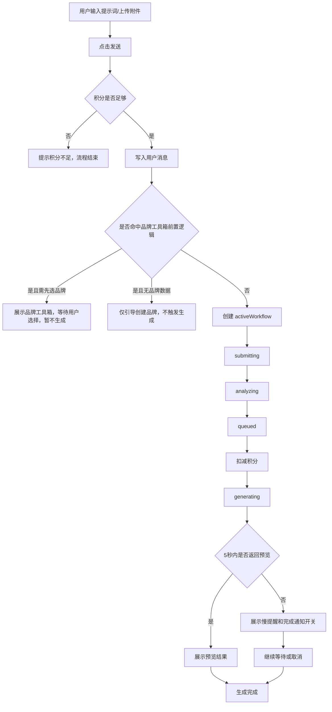
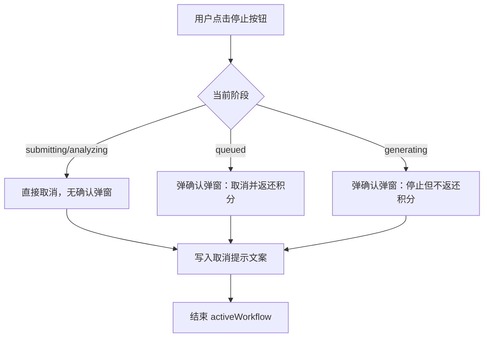

# 生成任务取消与慢提醒需求文档

## 1. 文档目的

本文档用于梳理“用户发送生成请求后，到取消任务、以及生成中较慢提醒”这一段链路的现有业务逻辑，并补充为可直接用于开发联调、测试设计和产品对齐的需求文档。

本文档基于当前前端实现整理，覆盖：

- 请求发送入口
- 任务状态流转
- 取消逻辑
- 积分扣减/返还逻辑
- 生成中慢提醒
- 完成通知
- 异常提示
- 测试用例

不覆盖：

- 品牌工具箱详情内容本身
- 具体生图/生视频模型能力
- 生成结果落画布后的编辑能力

---

## 2. 适用范围

适用对象：

- 产品经理
- 前端开发
- 后端开发
- 测试工程师

适用模块：

- 对话侧边栏生成链路
- 图片/视频生成任务的取消、慢提醒、完成提醒

相关代码位置：

- [src/components/Sidebar.tsx](/Users/zhaowenwen/Cursor/创客贴-无限画布/src/components/Sidebar.tsx:66)
- [src/services/generationWorkflow.ts](/Users/zhaowenwen/Cursor/创客贴-无限画布/src/services/generationWorkflow.ts:1)
- [src/types.ts](/Users/zhaowenwen/Cursor/创客贴-无限画布/src/types.ts:39)

---

## 3. 业务目标

### 3.1 核心目标

用户发起生成后，需要让其明确感知：

- 当前任务是否已成功提交
- 当前任务处于哪个阶段
- 什么时候可以取消
- 取消后是否返还积分
- 为什么生成较慢
- 如果等待时间过长，是否可以开启完成提醒
- 取消后如何重新生成

### 3.2 设计原则

- 阶段清晰：不同阶段展示不同状态和不同取消策略
- 成本透明：积分扣减和返还规则明确可见
- 风险可控：进入正式生成前后，取消成本差异必须明确提示
- 体验兜底：生成变慢时，给用户解释和通知能力
- 可继续操作：取消后明确引导“编辑输入信息后再次发送，重新生成”

---

## 4. 术语定义

- 任务：用户一次发送后触发的一次生成流程
- 媒体类型：图片或视频
- 状态阶段：
  - `submitting`：正在提交需求
  - `analyzing`：正在解析需求
  - `queued`：正在创建生成任务 / 排队中
  - `generating`：正式生成中
- 慢提醒：进入 `generating` 后超过 5 秒仍未返回预览结果时展示的解释性提示
- 完成提醒：用户授权浏览器通知后，任务完成时触发的系统通知

---

## 5. 整体流程

### 5.1 主流程

### 5.2 取消流程

---

## 6. 功能范围与触发条件

### 6.1 发送请求

用户点击发送时，系统执行以下校验和动作：

1. 输入内容为空时，不允许发送。
2. 当前已有进行中的任务时，发送按钮变为停止按钮，不再触发新任务。
3. 先根据提示词和附件推算本次任务预计消耗积分。
4. 若当前积分不足，输出积分不足提示，流程结束。
5. 若积分足够：
   - 写入一条用户消息
   - 清空输入框
   - 根据品牌前置逻辑决定是否立即进入生成
   - 可进入生成时，创建任务并开始状态流转

### 6.2 状态流转

正常任务状态流转固定为：

1. `submitting`
2. `analyzing`
3. `queued`
4. `generating`
5. 完成或失败或取消

### 6.3 慢提醒触发条件

慢提醒仅在以下条件同时满足时出现：

- 当前任务已进入 `generating`
- 已记录 `generatingStartedAt`
- 从进入 `generating` 开始累计超过 5 秒
- 当前尚未返回预览结果

### 6.4 完成提醒触发条件

完成提醒需同时满足：

- 用户在慢提醒区域点击“开启”
- 浏览器通知权限为 `granted`
- 任务生成结果已返回

---

## 7. 状态机说明

### 7.1 阶段定义

#### `submitting`

- 含义：用户请求已发出，系统正在提交需求
- 前端文案：`正在提交需求`
- 积分：未扣减
- 用户操作：可直接取消，无二次确认

#### `analyzing`

- 含义：系统正在解析提示词和附件
- 前端文案：`正在解析需求`
- 积分：未扣减
- 用户操作：可直接取消，无二次确认

#### `queued`

- 含义：系统已开始创建生成任务，进入排队/任务创建阶段
- 前端文案：`正在创建生成任务`
- 积分：在进入该阶段时立即扣减
- 用户操作：点击停止后弹确认框，确认后取消并返还积分

#### `generating`

- 含义：任务已进入正式生成阶段
- 前端文案：
  - 图片：`正在生成图片`
  - 视频：`正在生成视频`
- 积分：已扣减
- 用户操作：点击停止后弹确认框，确认后停止，但不返还积分

---

## 8. 积分业务规则

### 8.1 预计消耗计算

当前实现规则如下：

- 图片默认模型：`Seedream 4.0`
- 带附件图片任务模型：`全能图像 2.0`
- 视频任务模型：`可灵视频 1.6`

单次单位积分：

- `Seedream 4.0`：4 积分/张
- `全能图像 2.0`：4 积分/张
- `可灵视频 1.6`：20 积分/条

输出数量：

- 优先从提示词中识别“几张/几个/几条”
- 无明确数量时默认 4 个结果
- 最大上限 12

总积分：

- `总积分 = 输出数量 × 模型单价`

### 8.2 扣减时机

积分不是在点击发送时扣减，而是在任务进入 `queued` 阶段时扣减。

### 8.3 返还规则

- 在 `submitting` 或 `analyzing` 取消：未扣积分，无返还动作
- 在 `queued` 取消：返还全部已扣积分
- 在 `generating` 取消：不返还积分
- 任务执行异常且已扣积分：返还全部已扣积分

### 8.4 用户可见提示

当前用户可看到的核心提示：

- 积分不足提示
- 取消排队返积分提示
- 停止生成不返积分提示
- 异常返积分提示
- 成功消息中展示本次消耗积分

---

## 9. 交互说明

### 9.1 发送按钮

默认态：

- 输入为空：按钮禁用
- 输入有内容：按钮可点击，含义为“发送”

任务进行中：

- 按钮切换为“停止”
- 图标从发送箭头切换为停止方块
- 此时用户不可继续发起新任务

### 9.2 任务状态展示

当任务处于 `submitting/analyzing/queued` 且未显示思考面板、未显示生成面板时，仅展示一条简要阶段状态文案。

当任务处于 `generating` 时，展示生成面板，包含：

- 标题：`生成中...`
- 时间显示：`已耗时/预计总时长`
- 当前模型名
- 4 宫格预览占位
- 慢提醒文案区域
- 完成提醒开关

### 9.3 慢提醒展示

慢提醒在生成阶段延迟 5 秒后显示，文案为：

`亲爱的用户，由于近期需求增长，算力紧张，生成任务排队较多，出图变慢且偶有波动，请大家耐心等待~`

表现形式：

- 以打字机效果逐字出现
- 若结果已返回，则慢提醒区域不再显示

### 9.4 完成提醒开关

慢提醒区域下方展示通知提醒开关。

状态说明：

- 未开启且权限正常：展示“开启通知任务完成后提醒我”
- 开启后：展示“已开启提醒，我们将在任务完成后通知你”
- 浏览器权限被禁用：展示“浏览器通知已禁用，请先在浏览器设置中开启通知权限”

按钮说明：

- 默认：`开启`
- 已开启：`关闭`
- 权限禁用：`已禁用`

### 9.5 取消交互

#### `submitting/analyzing`

- 用户点击停止后直接取消
- 无二次确认弹窗

#### `queued`

- 点击停止后弹窗确认
- 弹窗标题：`确认取消排队中的任务？`
- 弹窗说明：当前任务仍在等待生成，建议继续等待结果返回。若现在取消，系统将返还积分
- 主按钮：`确认取消并返还积分`
- 次按钮：`继续等待`

#### `generating`

- 点击停止后弹窗确认
- 图片标题：`确认停止当前图片生成？`
- 视频标题：`确认停止当前视频生成？`
- 弹窗说明：当前任务已进入正式生成阶段，建议耐心等待结果返回。若现在取消，将停止任务且不返还积分
- 主按钮：`确认停止且不返还积分`
- 次按钮：`继续等待`

### 9.6 取消结果反馈

取消成功后，系统写入一条助手消息：

- `generating` 取消：
  - `已停止当前图片/视频生成任务，积分不返还。`
  - 换行补充：
  - `您可以编辑输入信息后再次发送，重新生成。`
- `queued` 取消：
  - `已取消当前任务，X 积分已返还。`
  - 换行补充：
  - `您可以编辑输入信息后再次发送，重新生成。`
- `submitting/analyzing` 取消：
  - `已取消当前任务，本阶段尚未扣除积分。`
  - 换行补充：
  - `您可以编辑输入信息后再次发送，重新生成。`

### 9.7 完成反馈

任务完成后，系统执行：

- 将结果加入画布
- 播放完成音效
- 播放庆祝动画
- 写入成功消息

成功消息包含：

- 返回结果数量
- 本次消耗积分
- 使用模型
- 结果图片列表

### 9.8 异常反馈

任务执行失败且已扣积分时：

- 自动返还积分
- 写入失败消息：
  - `任务执行失败，已为您返还 X 积分，请稍后重试。`

---

## 10. 文案清单

### 10.1 发送与状态

- 正在提交需求
- 正在解析需求
- 正在创建生成任务
- 正在生成图片
- 正在生成视频
- 生成中...

### 10.2 积分不足

- `当前积分不足。本次任务预计消耗 X 积分，你当前剩余 Y 积分，请减少输出数量或补充积分后再试。`

### 10.3 慢提醒

- `亲爱的用户，由于近期需求增长，算力紧张，生成任务排队较多，出图变慢且偶有波动，请大家耐心等待~`

### 10.4 取消相关

- `确认取消排队中的任务？`
- `确认取消并返还积分`
- `确认停止当前图片生成？`
- `确认停止当前视频生成？`
- `确认停止且不返还积分`
- `继续等待`

### 10.5 取消结果

- `已取消当前任务，本阶段尚未扣除积分。`
- `已取消当前任务，X 积分已返还。`
- `已停止当前图片生成任务，积分不返还。`
- `已停止当前视频生成任务，积分不返还。`
- `您可以编辑输入信息后再次发送，重新生成。`

### 10.6 完成提醒

- `开启通知任务完成后提醒我`
- `已开启提醒，我们将在任务完成后通知你`
- `浏览器通知已禁用，请先在浏览器设置中开启通知权限`
- `✅ 创作完成提醒`
- `你的图片/视频结果已生成完成，可以回来查看了。`

---

## 11. 功能点拆解

### 11.1 必须实现

- 支持发送图片/视频生成请求
- 支持按阶段展示状态
- 支持任务取消
- 支持分阶段的取消策略
- 支持积分预估
- 支持积分扣减与返还
- 支持生成中慢提醒
- 支持慢提醒后的完成通知开关
- 支持取消后重新生成引导

### 11.2 建议测试重点覆盖

- 各阶段取消差异
- 积分扣返边界
- 慢提醒出现与消失时机
- 通知权限分支
- 成功/失败/取消三条主线

---

## 12. 异常与边界情况

### 12.1 输入为空

- 不允许发送
- 按钮禁用

### 12.2 积分不足

- 不创建任务
- 不清空输入框
- 输出提示消息

### 12.3 任务进行中重复点击发送

- 不允许
- 按钮语义已切换为停止

### 12.4 任务已取消但异步结果晚到

现有实现通过 `isCancelled` 标记阻断后续流程，避免取消后继续写成功消息或继续执行正常完成逻辑。

### 12.5 浏览器通知权限为 denied

- 不允许点击“开启”
- 显示权限受限文案

### 12.6 慢提醒与预览结果互斥

- 当已有预览结果时，慢提醒区域不再显示

### 12.7 预览位数量

- 当前生成面板固定展示 4 个预览位
- 即使任务请求输出数量不为 4，当前 UI 仍按 4 宫格展示生成中的占位

说明：

这属于现实现状，若后续支持 1/2/3/5/8/12 等不同数量的动态预览布局，需单独出需求。

---

## 13. 测试用例

### 13.1 正常发送

#### 用例 1：图片任务发送成功

- 前置条件：输入有效图片需求，积分充足
- 操作步骤：点击发送
- 预期结果：
  - 写入用户消息
  - 输入框清空
  - 状态依次流转为 `submitting -> analyzing -> queued -> generating`
  - 进入 `queued` 时扣积分
  - 完成后展示成功消息和结果

#### 用例 2：视频任务发送成功

- 前置条件：输入含“视频/短片”等关键词或上传视频附件，积分充足
- 操作步骤：点击发送
- 预期结果：
  - 任务被识别为视频
  - 生成中阶段文案为“正在生成视频”
  - 成功消息按视频文案展示

### 13.2 积分校验

#### 用例 3：积分不足

- 前置条件：任务预计消耗大于当前剩余积分
- 操作步骤：点击发送
- 预期结果：
  - 不创建任务
  - 不进入状态流转
  - 输出积分不足提示

### 13.3 取消逻辑

#### 用例 4：`submitting` 阶段取消

- 前置条件：任务刚提交，仍处于 `submitting`
- 操作步骤：点击停止
- 预期结果：
  - 直接取消，无弹窗
  - 输出“本阶段尚未扣除积分”提示
  - 补充“编辑输入信息后再次发送，重新生成”
  - 不发生积分变动

#### 用例 5：`analyzing` 阶段取消

- 前置条件：任务处于 `analyzing`
- 操作步骤：点击停止
- 预期结果：
  - 直接取消，无弹窗
  - 不返积分
  - 原因是此阶段尚未扣积分

#### 用例 6：`queued` 阶段取消并确认

- 前置条件：任务处于 `queued`，积分已扣
- 操作步骤：点击停止，弹窗中点击确认取消
- 预期结果：
  - 弹出确认框
  - 确认后任务取消
  - 全额返还积分
  - 输出“X 积分已返还”提示
  - 补充重新生成引导

#### 用例 7：`queued` 阶段取消后选择继续等待

- 前置条件：任务处于 `queued`
- 操作步骤：点击停止，弹窗中点击继续等待
- 预期结果：
  - 弹窗关闭
  - 任务继续执行
  - 不返积分

#### 用例 8：`generating` 阶段取消并确认

- 前置条件：任务处于 `generating`
- 操作步骤：点击停止，弹窗中点击确认停止
- 预期结果：
  - 弹出确认框
  - 确认后任务取消
  - 不返积分
  - 输出“积分不返还”提示
  - 补充重新生成引导

#### 用例 9：`generating` 阶段取消后继续等待

- 前置条件：任务处于 `generating`
- 操作步骤：点击停止，弹窗中点击继续等待
- 预期结果：
  - 弹窗关闭
  - 任务继续生成
  - 不产生其他副作用

### 13.4 慢提醒

#### 用例 10：生成 5 秒后出现慢提醒

- 前置条件：任务进入 `generating` 且 5 秒内无预览结果
- 操作步骤：等待超过 5 秒
- 预期结果：
  - 展示慢提醒模块
  - 慢提醒文案逐字展示
  - 显示通知开关区域

#### 用例 11：5 秒内返回预览，不展示慢提醒

- 前置条件：任务进入 `generating` 后快速返回预览结果
- 操作步骤：观察生成面板
- 预期结果：
  - 不显示慢提醒模块，或慢提醒区域保持隐藏

#### 用例 12：有预览结果后慢提醒消失

- 前置条件：慢提醒已出现，随后返回预览结果
- 操作步骤：等待结果返回
- 预期结果：
  - 慢提醒区域隐藏
  - 预览图正常显示

### 13.5 通知提醒

#### 用例 13：授权通知并完成

- 前置条件：通知权限允许
- 操作步骤：
  - 在慢提醒区域点击开启
  - 等待任务完成
- 预期结果：
  - 开关状态变为已开启
  - 任务完成后收到浏览器系统通知
  - 提醒开关自动重置为关闭

#### 用例 14：通知权限被拒绝

- 前置条件：浏览器通知权限为 denied
- 操作步骤：进入慢提醒区域
- 预期结果：
  - 展示“浏览器通知已禁用”文案
  - 开启按钮置灰不可点击

### 13.6 异常处理

#### 用例 15：任务失败且已扣积分

- 前置条件：任务已进入 `queued` 或之后阶段，且执行失败
- 操作步骤：模拟接口失败
- 预期结果：
  - 自动返还全部积分
  - 输出失败返积分提示
  - 不展示成功结果

#### 用例 16：任务失败但未扣积分

- 前置条件：在 `submitting/analyzing` 前后异常退出且未进入扣积分节点
- 操作步骤：模拟早期失败
- 预期结果：
  - 不出现返积分动作
  - 不发生重复返还

### 13.7 结果反馈

#### 用例 17：完成反馈完整

- 前置条件：任务成功完成
- 操作步骤：等待任务完成
- 预期结果：
  - 结果加入画布
  - 播放完成音效
  - 出现庆祝动画
  - 写入成功消息
  - 成功消息包含模型、积分、结果数量

---

## 14. 验收标准

### 14.1 业务验收

- 用户可明确区分“排队中取消返积分”和“生成中取消不返积分”
- 慢提醒只在生成变慢时出现，不应过早打扰
- 用户看到慢提醒后可以开启完成通知
- 取消后有明确重新生成引导

### 14.2 交互验收

- 停止按钮在任务进行中可见且可用
- `queued/generating` 阶段取消必须有确认弹窗
- 取消文案换行展示，补充引导清晰可见

### 14.3 测试验收

- 测试用例 1-17 至少全量通过
- 积分扣返日志与页面表现一致
- 通知权限三种状态 `default/granted/denied` 均覆盖

---

## 15. 现状说明与后续建议

### 15.1 当前实现现状

- 积分扣减发生在 `queued`，不是点击发送时
- 慢提醒只在 `generating` 阶段触发，不覆盖 `queued`
- 慢提醒阈值固定为 5 秒
- 生成中的预览位固定为 4 宫格
- 取消后已补充“编辑输入信息后再次发送，重新生成”文案

### 15.2 建议后续进一步明确的点

- `queued` 是否也需要单独的“排队过久提醒”
- 预估时长 2 分钟是否需要按模型/任务类型动态调整
- 结果数量不为 4 时，生成中面板是否改为动态格数
- 取消后是否需要一键回填上次输入内容并聚焦输入框
- 通知提醒是否要支持站内提醒，而不仅是浏览器系统通知

---

## 16. 开发与测试沟通建议

与开发沟通时，重点对齐：

- 状态机节点和积分扣返时机
- 哪些阶段取消需要弹窗，哪些不需要
- 慢提醒出现和隐藏条件
- 通知权限不同状态的按钮和文案

与测试沟通时，重点对齐：

- 取消分支必须按阶段拆开验证
- 积分不能出现少扣、重复返还、取消后未返还等问题
- 慢提醒与结果预览显示顺序要验证
- 成功、失败、取消三条链路都要覆盖

---

## 17. 结论

本链路的核心业务判断点有 3 个：

1. 任务处于哪个阶段
2. 积分是否已扣减
3. 生成是否已慢到需要提醒

只要围绕这 3 个判断点统一前后端语义，开发实现和测试验证就会比较稳定，也更容易避免“取消规则不一致”“积分扣返混乱”“用户不知道还能怎么继续操作”这类问题。
